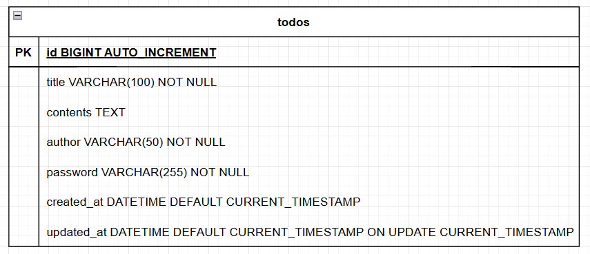
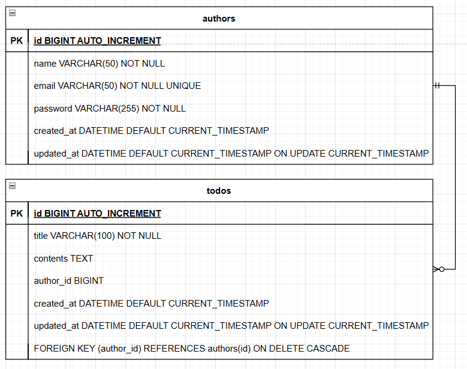

# CH 3: 일정 관리 앱 만들기
## 단계별 요구사항
`필수 기능`
- Lv 0. API 명세 및 ERD 작성
- Lv 1. 일정 생성 및 조회
- Lv 2. 일정 수정 및 삭제

`도전 기능`
- Lv 3. 연관 관계 설정
- Lv 4. 페이지네이션
- Lv 5. 예외 발생 처리

## API 명세서
- Postman: [document](https://documenter.getpostman.com/view/44635744/2sB2j9687J)

[//]: # (일정 생성)
<details>
<summary>일정 생성 API</summary>

- Method: POST
- URL: `/todos`
- Request Body
```json5
{
  "title": "Spring 공부",
  "contents": "Spring 기초 1~3주차 강의 학습",
  "author": "김나경",
  "password": "1234"
}
```
- Response (201 Created)

```json
{
  "id": 1,
  "title": "Spring 공부",
  "contents": "Spring 기초 1~3주차 강의 학습",
  "author": "김나경",
  "createdAt": "2025-05-10T09:00:00+09:00",
  "updatedAt": "2025-05-10T09:00:00+09:00"
}
```
</details>

[//]: # (전체 일정 조회)
<details>
<summary>전체 일정 조회 API</summary>

- Method: GET
- URL: `/todos`
- Query Parameters
    - updatedAt: 수정일
        - type: String
        - format: YYYY-MM-DD
        - required: false
    - author: 작성자명
        - type: String
        - required: false
- Response (200 OK)
```json
[
  {
    "id": 1,
    "title": "Spring 공부",
    "contents": "Spring 기초 1~3주차 강의 학습",
    "author": "김나경",
    "createdAt": "2025-05-10T09:00:00+09:00",
    "updatedAt": "2025-05-10T09:00:00+09:00"
  },
  {
    "id": 2,
    "title": "Java 복습",
    "contents": "Java 실습 복습",
    "author": "김나나",
    "createdAt": "2025-05-11T09:00:00+09:00",
    "updatedAt": "2025-05-11T09:00:00+09:00"
  }
]
```
</details>

[//]: # (선택 일정 조회)
<details>
<summary>선택 일정 조회 API</summary>

- Method: GET
- URL: `/todos/{id}`
- Response (200 OK)
```json
{
  "id": 1,
  "title": "Spring 공부",
  "contents": "Spring 기초 1~3주차 강의 학습",
  "author": "김나경",
  "createdAt": "2025-05-10T09:00:00+09:00",
  "updatedAt": "2025-05-10T09:00:00+09:00"
}
```
- Response (404 Not Found)
```json
{
  "error": "해당 일정이 존재하지 않습니다."
}
```

</details>

[//]: # (선택 일정 수정)
<details>
<summary>선택 일정 수정 API</summary>

- Method: PATCH
- URL: `/todos/{id}`
- Request Body
```json5
{
  "title": "Spring 심화 공부",
  "contents": "Spring 심화 1~3주차 강의 학습",
  "author": "김나경",
  "password": "1234"
}
```

- Response (200 OK)
```json
{
  "id": 1,
  "title": "Spring 심화 공부",
  "contents": "Spring 심화 1~3주차 강의 학습",
  "author": "김나경",
  "createdAt": "2025-05-10T09:00:00+09:00",
  "updatedAt": "2025-05-12T09:00:00+09:00"
}
```
- Response (404 Not Found)
```json
{
  "error": "해당 일정이 존재하지 않습니다."
}
```
- Response (403 Forbidden)
```json
{
  "error": "비밀번호가 일치하지 않습니다."
}
```
</details>

[//]: # (선택 일정 삭제)
<details>
<summary>선택 일정 삭제 API</summary>

- Method: POST
- URL: `/todos/{id}`
- Request Body
```json5
{
  "password": "1234"
}
```

- Response (200 OK)
```json
{
  "message": "일정이 성공적으로 삭제되었습니다."
}
```
- Response (404 Not Found)
```json
{
  "error": "해당 일정이 존재하지 않습니다."
}
```
- Response (403 Forbidden)
```json
{
  "error": "비밀번호가 일치하지 않습니다."
}
```
</details>


## ERD 설계 및 구현
- 개념적 설계: 
  - 
- 논리적 설계(ERD): 
  - 
- 물리적 설계(SQL): 
  - [todo.sql](./todo.sql)
  - 


