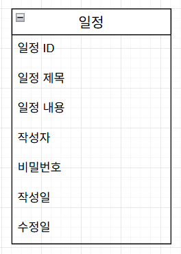

# CH 3: 일정 관리 앱 만들기
## 단계별 요구사항
`필수 기능`
- Lv 0. API 명세 및 ERD 작성
- Lv 1. 일정 생성 및 조회
- Lv 2. 일정 수정 및 삭제

`도전 기능`
- Lv 3. 연관 관계 설정
- Lv 4. 페이지네이션
- Lv 5. 예외 발생 처리
- Lv 6. null 체크 및 특정 패턴에 대한 검증 수행

## API 명세서
- Postman: [document](https://documenter.getpostman.com/view/44635744/2sB2j9687J)

### 필수기능

[//]: # (일정 생성)
<details>
<summary>일정 생성 API</summary>

- Method: POST
- URL: `/api/v1/todos`
- Request Body
```json5
{
  "title": "Spring 공부",
  "contents": "Spring 기초 1~3주차 강의 학습",
  "author": "김나경",
  "password": "1234"
}
```
- Response (201 Created)

```json
{
  "id": 1,
  "title": "Spring 공부",
  "contents": "Spring 기초 1~3주차 강의 학습",
  "author": "김나경",
  "createdAt": "2025-05-10T09:00:00+09:00",
  "updatedAt": "2025-05-10T09:00:00+09:00"
}
```
</details>

[//]: # (전체 일정 조회)
<details>
<summary>전체 일정 조회 API</summary>

- Method: GET
- URL: `/api/v1/todos`
- Query Parameters
    - updatedAt: 수정일
        - type: String
        - format: YYYY-MM-DD
        - required: false
    - author: 작성자명
        - type: String
        - required: false
- Response (200 OK)
```json
[
  {
    "id": 1,
    "title": "Spring 공부",
    "contents": "Spring 기초 1~3주차 강의 학습",
    "author": "김나경",
    "createdAt": "2025-05-10T09:00:00+09:00",
    "updatedAt": "2025-05-10T09:00:00+09:00"
  },
  {
    "id": 2,
    "title": "Java 복습",
    "contents": "Java 실습 복습",
    "author": "김나나",
    "createdAt": "2025-05-11T09:00:00+09:00",
    "updatedAt": "2025-05-11T09:00:00+09:00"
  }
]
```
</details>

[//]: # (선택 일정 조회)
<details>
<summary>선택 일정 조회 API</summary>

- Method: GET
- URL: `/api/v1/todos/{id}`
- Response (200 OK)
```json
{
  "id": 1,
  "title": "Spring 공부",
  "contents": "Spring 기초 1~3주차 강의 학습",
  "author": "김나경",
  "createdAt": "2025-05-10T09:00:00+09:00",
  "updatedAt": "2025-05-10T09:00:00+09:00"
}
```
- Response (404 Not Found)
```json
{
  "error": "해당 일정이 존재하지 않습니다."
}
```

</details>

[//]: # (선택 일정 수정)
<details>
<summary>선택 일정 수정 API</summary>

- Method: PATCH
- URL: `/api/v1/todos/{id}`
- Request Body
```json5
{
  "title": "Spring 심화 공부",
  "contents": "Spring 심화 1~3주차 강의 학습",
  "author": "김나경",
  "password": "1234"
}
```

- Response (200 OK)
```json
{
  "id": 1,
  "title": "Spring 심화 공부",
  "contents": "Spring 심화 1~3주차 강의 학습",
  "author": "김나경",
  "createdAt": "2025-05-10T09:00:00+09:00",
  "updatedAt": "2025-05-12T09:00:00+09:00"
}
```
- Response (404 Not Found)
```json
{
  "error": "해당 일정이 존재하지 않습니다."
}
```
- Response (403 Forbidden)
```json
{
  "error": "비밀번호가 일치하지 않습니다."
}
```
</details>

[//]: # (선택 일정 삭제)
<details>
<summary>선택 일정 삭제 API</summary>

- Method: POST
- URL: `/api/v1/todos/{id}`
- Request Body
```json5
{
  "password": "1234"
}
```

- Response (200 OK)
```json
{
  "message": "일정이 성공적으로 삭제되었습니다."
}
```
- Response (404 Not Found)
```json
{
  "error": "해당 일정이 존재하지 않습니다."
}
```
- Response (403 Forbidden)
```json
{
  "error": "비밀번호가 일치하지 않습니다."
}
```
</details>


### 도전 기능
[//]: # (일정 생성)
<details>
<summary>일정 생성 API</summary>

- Method: POST
- URL: `/api/v2/todos`
- Request Body
```json5
{
  "title": "Spring 공부",
  "contents": "Spring 기초 1~3주차 강의 학습",
  "authorId": 1,
  "password": "1234"
}
```
- Response (201 Created)

```json
{
  "id": 13,
  "title": "Spring 공부",
  "contents": "Spring 기초 1~3주차 강의 학습",
  "author": {
    "id": 1,
    "name": "김나경",
    "email": "gajicoding@gmail.com",
    "createdAt": "2025-05-12T14:33:11",
    "updatedAt": "2025-05-12T18:49:16"
  },
  "createdAt": "2025-05-12T14:33:11",
  "updatedAt": "2025-05-12T18:49:16"
}
```
</details>

[//]: # (전체 일정 조회)
<details>
<summary>전체 일정 조회 API</summary>

- Method: GET
- URL: `/api/v2/todos`
- Query Parameters
    - updatedAt: 수정일
        - type: String
        - format: YYYY-MM-DD
        - required: false
    - authorId: 작성자 ID
        - type: Long
        - required: false
    - page: 페이지 번호
        - type: int
        - required: false
    - size: 페이지 크기
        - type: int
        - required: false
- Response (200 OK)
```json
{
  "data": [
    {
      "id": 10,
      "title": "Spring 공부",
      "contents": "Spring 기초 1~3주차 강의 학습",
      "author": {
        "id": 1,
        "name": "김나경",
        "email": "gajicoding@gmail.com",
        "createdAt": "2025-05-12T14:33:11",
        "updatedAt": "2025-05-12T17:18:45"
      },
      "createdAt": "2025-05-12T14:33:11",
      "updatedAt": "2025-05-12T17:18:45"
    },
    {
      "id": 11,
      "title": "Spring 공부",
      "contents": "Spring 기초 1~3주차 강의 학습",
      "author": {
        "id": 1,
        "name": "김나경",
        "email": "gajicoding@gmail.com",
        "createdAt": "2025-05-12T14:33:11",
        "updatedAt": "2025-05-12T17:18:45"
      },
      "createdAt": "2025-05-12T14:33:11",
      "updatedAt": "2025-05-12T17:18:45"
    }
  ],
  "page": 1,
  "size": 2,
  "totalElements": 10,
  "totalPages": 5
}
```
</details>

[//]: # (선택 일정 조회)
<details>
<summary>선택 일정 조회 API</summary>

- Method: GET
- URL: `/api/v2/todos/{id}`
- Response (200 OK)
```json
{
  "id": 1,
  "title": "Spring 심화 공부1",
  "contents": "Spring 심화 1~3주차 강의 학습",
  "author": {
    "id": 1,
    "name": "김나경",
    "email": "gajicoding@gmail.com",
    "createdAt": "2025-05-12T14:33:11",
    "updatedAt": "2025-05-12T17:17:58"
  },
  "createdAt": "2025-05-12T14:33:11",
  "updatedAt": "2025-05-12T17:17:58"
}
```

</details>

[//]: # (선택 일정 수정)
<details>
<summary>선택 일정 수정 API</summary>

- Method: PATCH
- URL: `/api/v2/todos/{id}`
- Request Body
```json5
{
  "title": "Spring 심화 공부1",
  "contents": "Spring 심화 1~3주차 강의 학습",
  "authorId": 1,
  "password": "1234"
}
```

- Response (200 OK)
```json
{
  "id": 1,
  "title": "Spring 심화 공부1",
  "contents": "Spring 심화 1~3주차 강의 학습",
  "author": {
    "id": 1,
    "name": "김나경",
    "email": "gajicoding@gmail.com",
    "createdAt": "2025-05-12T14:33:11",
    "updatedAt": "2025-05-12T17:17:58"
  },
  "createdAt": "2025-05-12T14:33:11",
  "updatedAt": "2025-05-12T17:17:58"
}
```
</details>

[//]: # (선택 일정 삭제)
<details>
<summary>선택 일정 삭제 API</summary>

- Method: POST
- URL: `/api/v2/todos/{id}`
- Request Body
```json5
{
  "authorId": 1,
  "password": "1234"
}
```

- Response (200 OK)
```json
{
  "message": "일정이 성공적으로 삭제되었습니다."
}
```
</details>

## 데이터 베이스 설계
<details>
<summary>필수 기능 DB 설계</summary>

- 개념적 설계:
    - 
- 논리적 설계(ERD):
    - 
- 물리적 설계(SQL):
    - [todo.sql](./todo.sql)
    - 
</details>

<details>
<summary>도전 기능 DB 설계</summary>

- 개념적 설계:
    - 
- 논리적 설계(ERD):
    - 
- 물리적 설계(SQL):
    - [todo_v2.sql](./todo_v2.sql)
    - 
</details>

## 새로운 지식
프로젝트를 진행하면서 알게된 지식 정리
- [빌더 패턴 (Builder Pattern)](https://gajicoding.tistory.com/325)
- [생성자 vs 정적 팩토리 메서드 vs 빌더 패턴](https://gajicoding.tistory.com/327)
- [Entity와 DTO(Data Transfer Object)의 차이](https://gajicoding.tistory.com/324)
- (비공개) [Repository에서 Request/Response DTO 를 사용해도 될까?](https://gajicoding.tistory.com/328)
- [다중 데이터소스 설정 하기 (feat. DB 여러 개 연결하기)](https://gajicoding.tistory.com/331)

## 문제 해결 (트러블 슈팅)
프로젝트를 진행하면서 겪은 문제 상황, 해결 정리
- [406 Not Acceptable - responseDTO @Getter 의 중요성](https://gajicoding.tistory.com/329)
- [Caused by: java.lang.IllegalArgumentException: jdbcUrl is required with driverClassName.](https://gajicoding.tistory.com/332)


